# Shelton Heritage Image Review

Prepared for review of the live homepage archive carousel, About-page montage, and towel timeline.

For each placement, mark one status and add any confirmed names, date, location, event, relationship to the Shelton family, or correction to the current story.

Status key: `[ ] Approve` `[ ] Revise` `[ ] Replace`

## Remaining production notes

- Confirmed dates and facts now align across the homepage, montage, and towel timeline.
- The legacy filenames `john-shelton-sr-1901.jpeg` and `unit-laundry-pressing-room-1940.jpeg` were retained to avoid breaking existing asset links; their displayed dates now reflect the confirmed history.
- The current Shelton Cleaners exterior photograph is also used to illustrate the 2019 opening chapter in the timeline.
- Jordan Hudson has a completed role, biography, phone number, and email, but his reserved montage slot still needs a portrait.

## 1. Homepage archive carousel — 5 placements

### Home 01 — John Shelton, Sr.

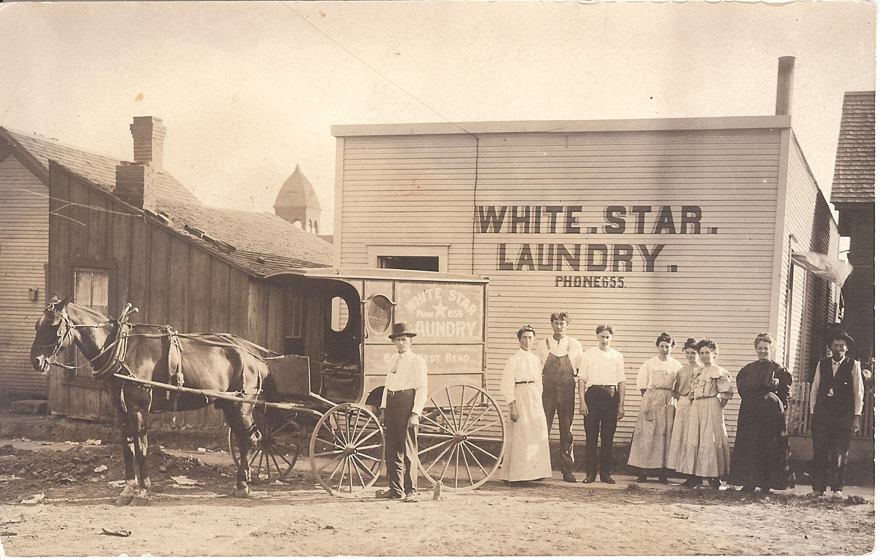

- File: `assets/images/history/john-shelton-sr-1901.jpeg`
- Current date and location: **c. 1898 · Oklahoma**
- Current title: **John Shelton, Sr.**
- Current story: Grandpa and Grandma Shelton, together with Gertie, Elma, Mary, John Shelton, Sr., Mason Shelton, and others, opened White Star Laundry in Oklahoma. Their shared undertaking established the family trade that later generations would carry forward.
- Review: `[ ] Approve` `[ ] Revise` `[ ] Replace`
- Partner notes:

### Home 02 — Early Laundry Operations

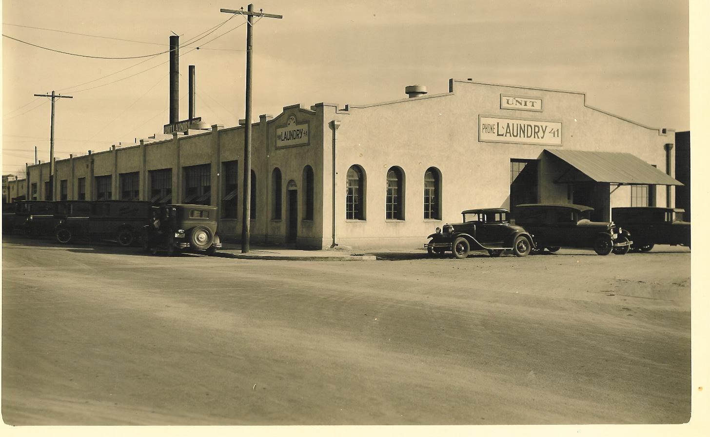

- File: `assets/images/history/unit-laundry-1930.jpeg`
- Current date and location: **1930s · Tucson**
- Current title: **Early Laundry Operations**
- Current story: This view of Unit Laundry captures the family business as it took root in Tucson during the 1930s. Even before later expansion, the work centered on careful processing, dependable service, and goods returned ready to use.
- Review: `[ ] Approve` `[ ] Revise` `[ ] Replace`
- Partner notes:

### Home 03 — Finished Properly

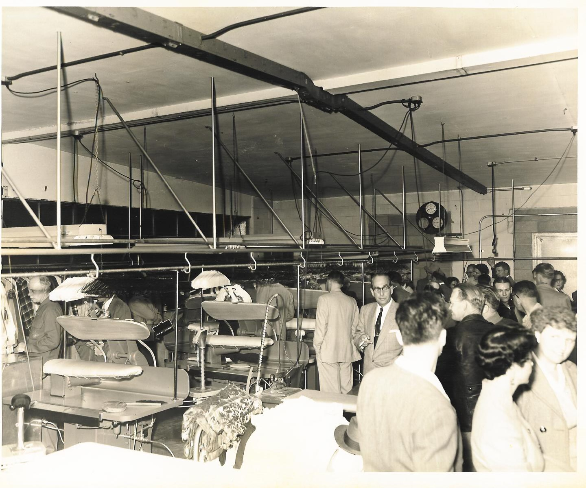

- File: `assets/images/history/unit-laundry-pressing-room-1940.jpeg`
- Current date and location: **Early 1950s · Old Town San Diego**
- Current title: **Finished Properly**
- Current story: At an early-1950s open house in Old Town San Diego, customers could see the equipment and finishing work behind the service. The machinery has changed dramatically since then, but Shelton's standard for clean, properly finished goods has remained.
- Review: `[ ] Approve` `[ ] Revise` `[ ] Replace`
- Partner notes:

### Home 04 — Cleaning Well

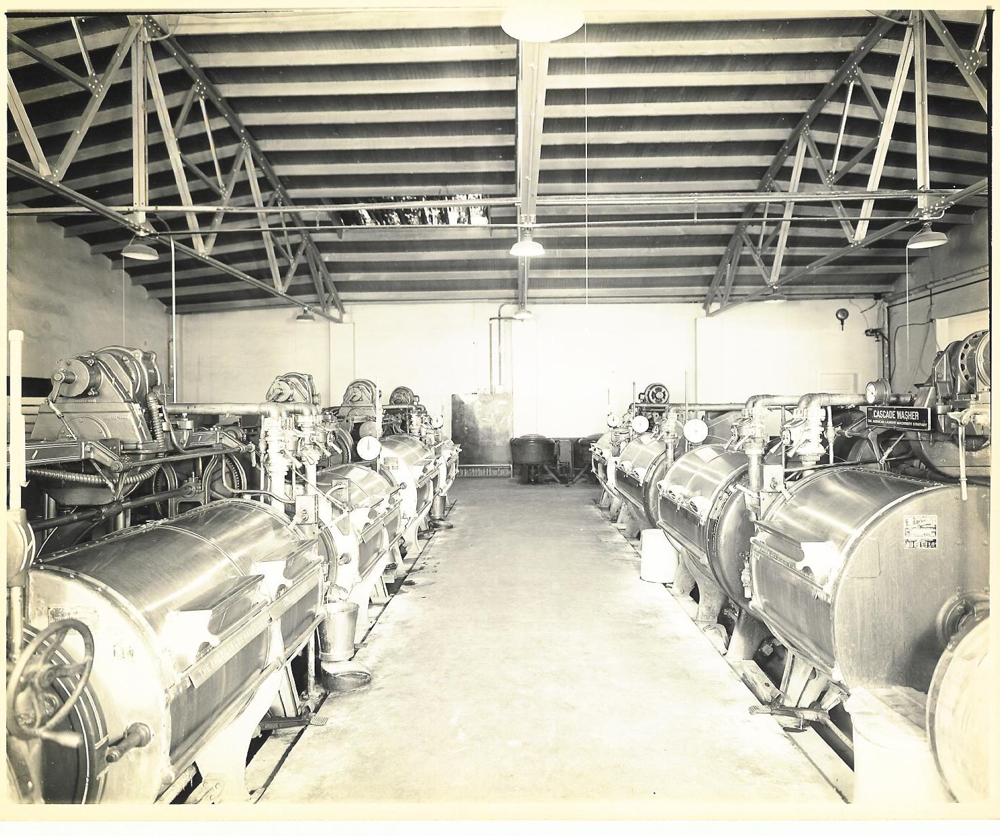

- File: `assets/images/history/unit-laundry-wash-room-1940.jpeg`
- Current date and location: **Early 1940s · Tucson**
- Current title: **Cleaning Well**
- Current story: Unit Laundry's cleaning room reveals the disciplined work behind every finished order: sorting, spotting, washing, handling, and inspection. Those same fundamentals still guide Shelton's commercial laundry programs today.
- Review: `[ ] Approve` `[ ] Revise` `[ ] Replace`
- Partner notes:

### Home 05 — San Diego Cleaner Roots

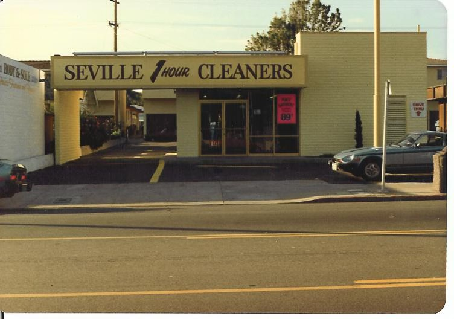

- File: `assets/images/history/seville-cleaners-pacific-beach-1979.jpeg`
- Current date: **1979**
- Current title: **San Diego Cleaner Roots**
- Current story: Seville Cleaners brought the family's cleaning tradition to Pacific Beach in 1979. Its neighborhood presence joined quality garment care with everyday convenience, values that continue to shape Shelton's service across San Diego.
- Review: `[ ] Approve` `[ ] Revise` `[ ] Replace`
- Partner notes:

## 2. About-page montage — 27 photo placements

The montage also contains a reserved Jordan Hudson slot with a story but no picture. It is not counted as a photo placement below.

### Montage 01 / photo-wall-01 — White Star Laundry

- Current era: **1898**
- Current story: White Star Laundry opened in 1898, establishing the foundation for four generations of the Shelton family in laundry and dry cleaning.
- Review: `[ ] Approve` `[ ] Revise` `[ ] Replace`
- Partner notes:

### Montage 02 / photo-wall-02 — Unit Laundry

- Current era: **1930s**
- Current story: Every generation of the family has worked in laundry or dry cleaning, carrying forward a standard built on cleaning well, finishing properly, and returning goods ready to use.
- Review: `[ ] Approve` `[ ] Revise` `[ ] Replace`
- Partner notes:

### Montage 03 / photo-wall-03 — Unit Cleaners San Diego

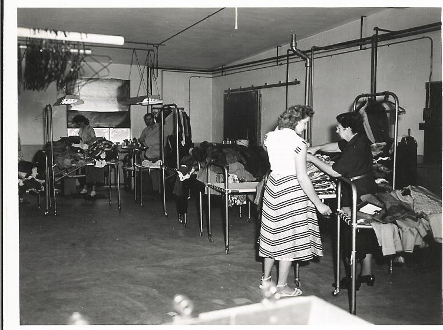

- Current era: **1950s**
- Current story: Unit Cleaners marked the family's first San Diego presence. The family built the facility and completed the installation and setup themselves.
- Review: `[ ] Approve` `[ ] Revise` `[ ] Replace`
- Partner notes:

### Montage 04 / photo-wall-04 — Seville Cleaners

- Current era: **1979**
- Current story: Seville Cleaners was one of more than 40 locations serving the San Diego region. Its drive-through window paired convenience with quality, a balance Shelton continues to value today.
- Review: `[ ] Approve` `[ ] Revise` `[ ] Replace`
- Partner notes:

### Montage 05 / photo-wall-05 — Cleaning room standards

- Current era: **1940s**
- Current story: The family history is practical, not decorative. It is about knowing how much care, sorting, spotting, washing, and finishing can change the final result.
- Review: `[ ] Approve` `[ ] Revise` `[ ] Replace`
- Partner notes:

### Montage 06 / photo-wall-06 — Tucson Steam Laundry

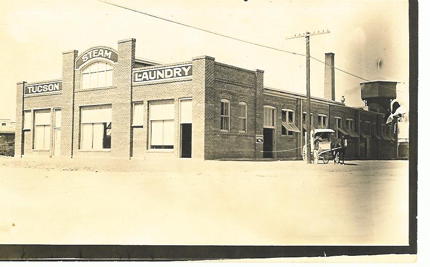

- Current era: **1913**
- Current story: Early steam-laundry operations depended on plant equipment, route work, and careful finishing long before modern commercial programs.
- Review: `[ ] Approve` `[ ] Revise` `[ ] Replace`
- Partner notes:

### Montage 07 / photo-wall-07 — Unit Laundry boiler room

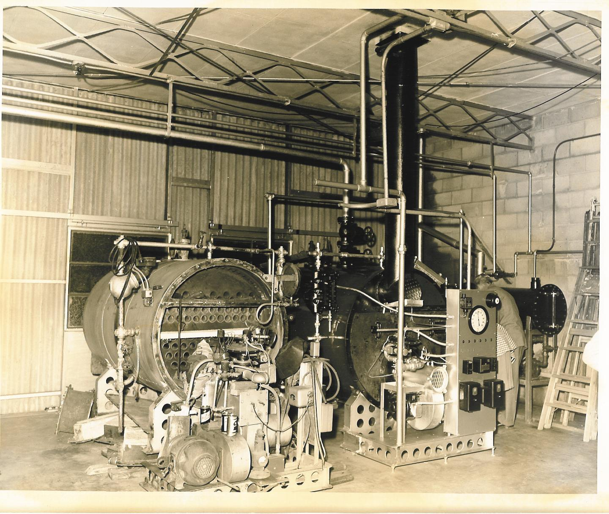

- Current era: **Early 1940s**
- Current story: Boiler rooms powered earlier laundry plants, turning heat, pressure, and equipment into the daily rhythm of cleaning work.
- Review: `[ ] Approve` `[ ] Revise` `[ ] Replace`
- Partner notes:

### Montage 08 / photo-wall-08 — State Street assembly area

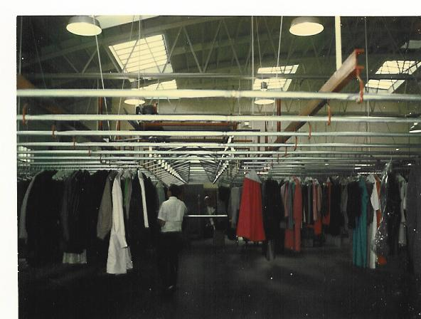

- Current era: **San Diego, 1960s**
- Current story: The State Street assembly area captures the organized back-of-house work behind cleaning, finishing, and getting garments ready to return.
- Review: `[ ] Approve` `[ ] Revise` `[ ] Replace`
- Partner notes:

### Montage 09 / photo-wall-09 — Eldorado Cleaners boiler room

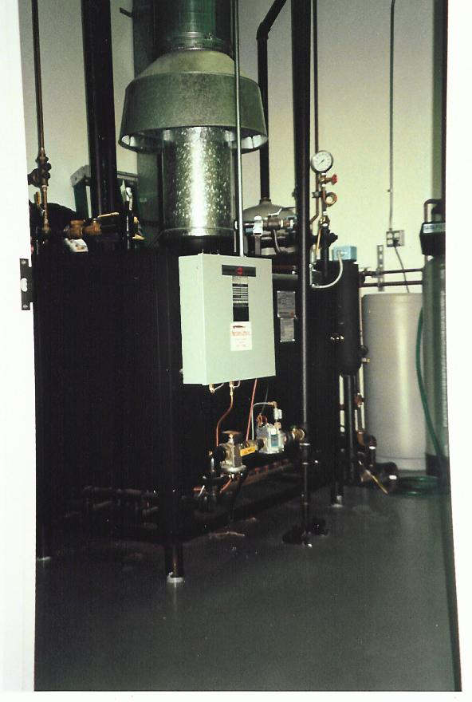

- Current era: **Las Vegas, 1997**
- Current story: Later boiler rooms show the same behind-the-scenes infrastructure carrying the family cleaning standard into newer decades.
- Review: `[ ] Approve` `[ ] Revise` `[ ] Replace`
- Partner notes:

### Montage 10 / photo-wall-10 — Sterling Cleaners boiler room

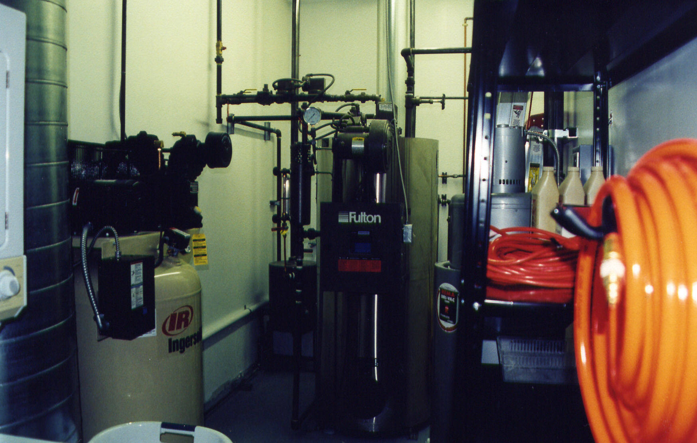

- Current era: **Indianapolis, 2003**
- Current story: The equipment changed over time, but the work still depended on reliable systems, steady handling, and plant discipline.
- Review: `[ ] Approve` `[ ] Revise` `[ ] Replace`
- Partner notes:

### Montage 11 / photo-wall-11 — Sterling Cleaners lobby

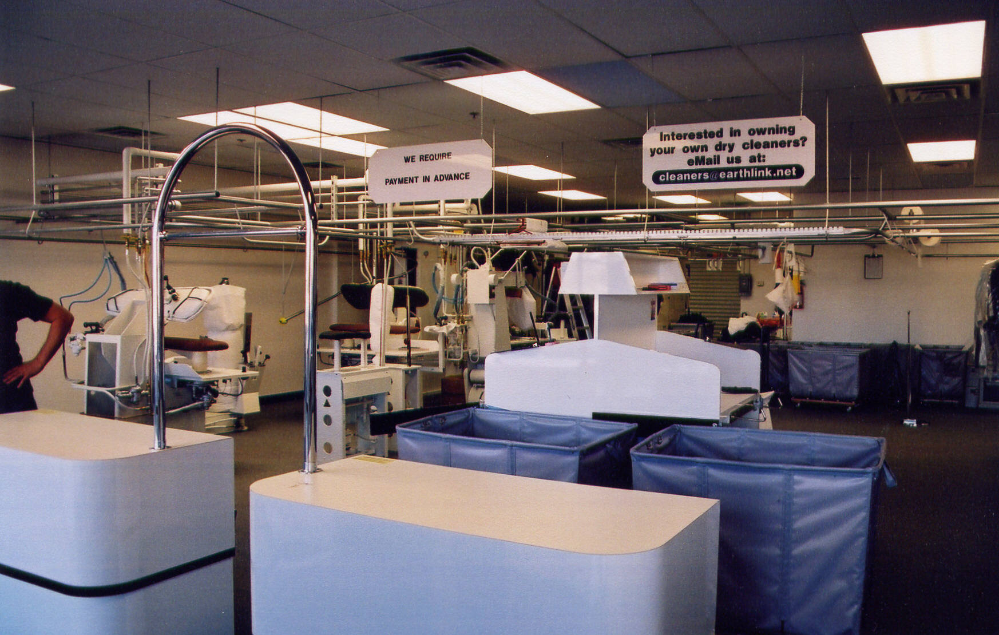

- Current era: **Las Vegas, 2003**
- Current story: Sterling Cleaners used an open layout so customers could see the work in progress and understand the care behind each completed order.
- Review: `[ ] Approve` `[ ] Revise` `[ ] Replace`
- Partner notes:

### Montage 12 / photo-wall-12 — Shelton Cleaners today

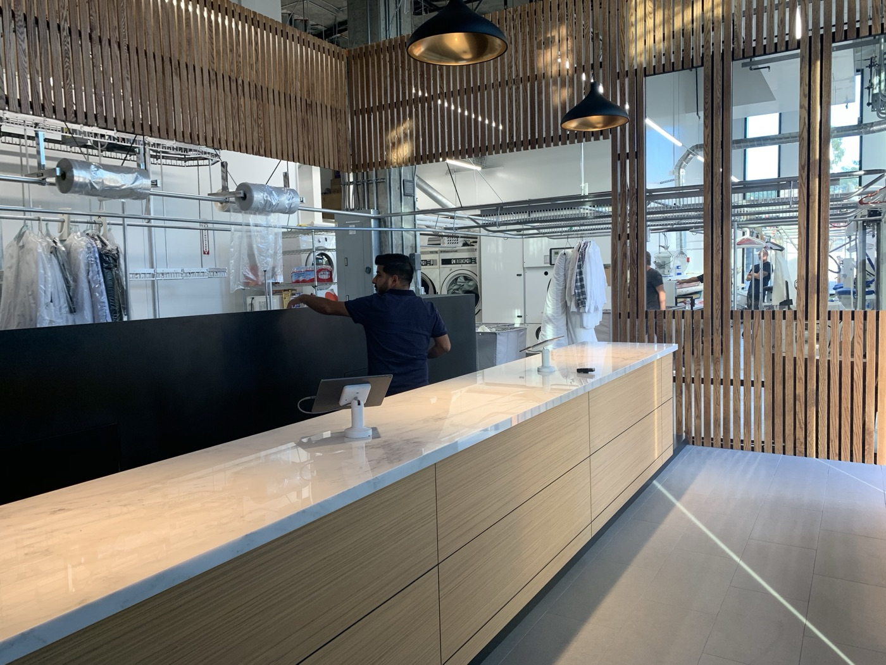

- Current era: **San Diego, today**
- Current story: The modern Shelton operation connects customer-facing service with the plant work behind cleaning, finishing, and organized return.
- Review: `[ ] Approve` `[ ] Revise` `[ ] Replace`
- Partner notes:

### Montage 13 / photo-wall-13 — John W. Shelton Sr. and Mr. Benz

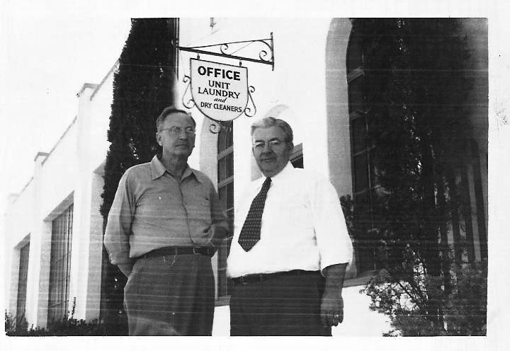

- Current era: **Early 1940s**
- Current story: John W. Shelton Sr. stands with office manager Mr. Benz outside Unit Laundry and Dry Cleaners, documenting another chapter in the family's laundry and cleaning work.
- Review: `[ ] Approve` `[ ] Revise` `[ ] Replace`
- Partner notes:

### Montage 14 / photo-wall-14 — Unit Cleaners delivery vans

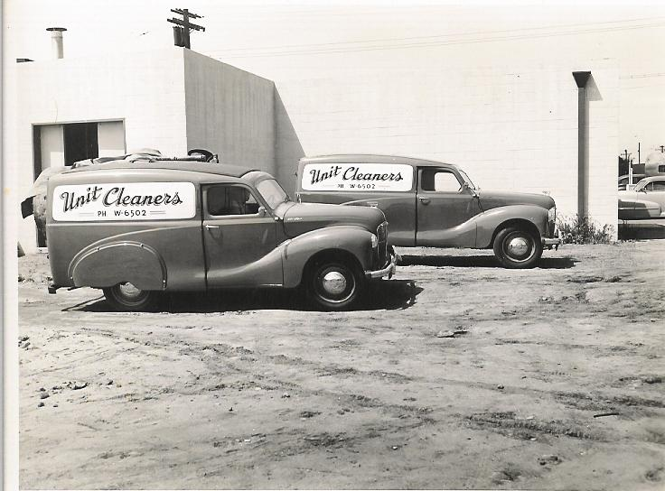

- Current era: **1950s**
- Current story: Delivery vans connected the cleaning plant to customers across San Diego, showing how route service has long been part of the work.
- Review: `[ ] Approve` `[ ] Revise` `[ ] Replace`
- Partner notes:

### Montage 15 / photo-wall-15 — Shelton family delivery archive

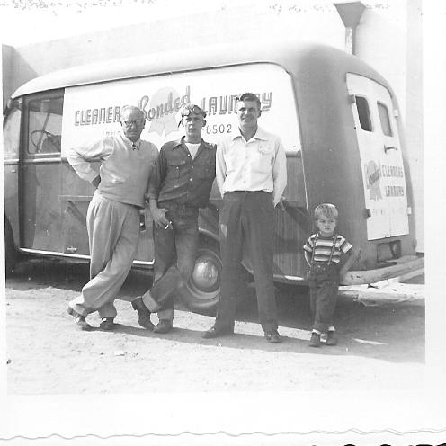

- Current era: **1954**
- Current story: John Shelton Sr., John Shelton Jr., William K. Brown, and Robert Brown are pictured with a Bonded Cleaners delivery van, tying family history to route service.
- Review: `[ ] Approve` `[ ] Revise` `[ ] Replace`
- Partner notes:

### Montage 16 / photo-wall-16 — Shelton Cleaners storefront

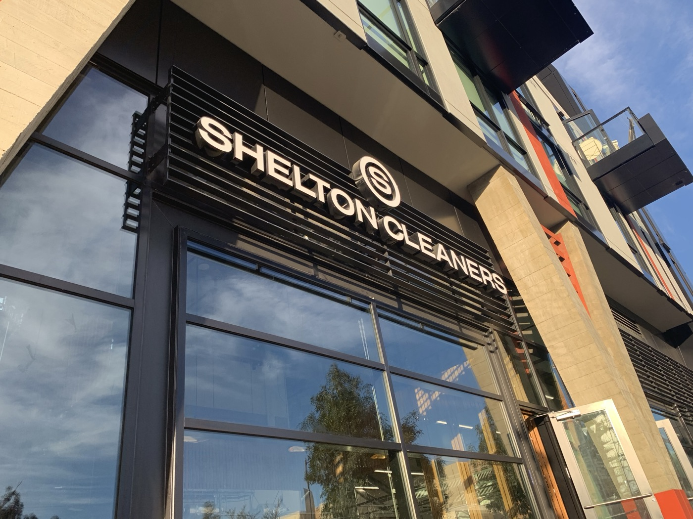

- Current era: **San Diego, today**
- Current story: The Shelton name now carries forward through a modern San Diego storefront and the commercial laundry work behind it.
- Review: `[ ] Approve` `[ ] Revise` `[ ] Replace`
- Partner notes:

### Montage 17 / photo-wall-17 — Commercial ironer

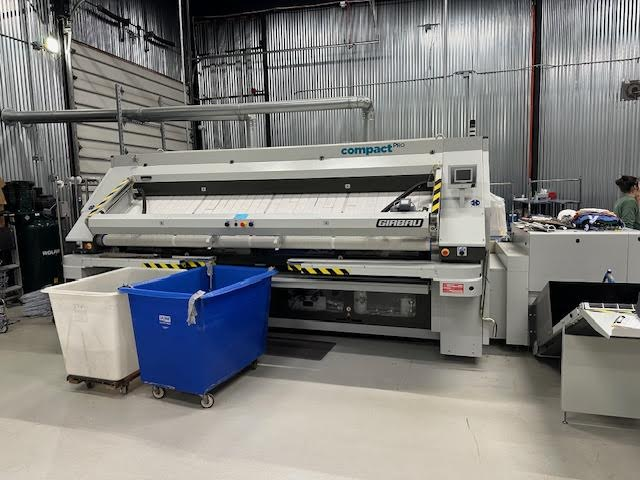

- Current era: **Shelton today**
- Current story: Modern finishing equipment helps Shelton move commercial linens from clean to crisp, consistent, and ready for customer return.
- Review: `[ ] Approve` `[ ] Revise` `[ ] Replace`
- Partner notes:

### Montage 18 / photo-wall-18 — Finished garments

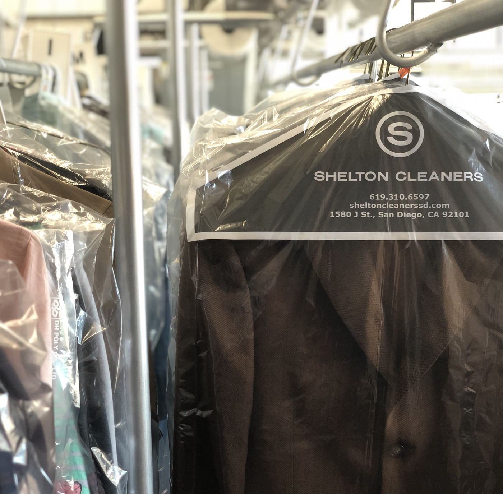

- Current era: **Shelton Cleaners**
- Current story: Finished garments show the customer-facing side of the work: clean, protected, organized, and ready to return.
- Review: `[ ] Approve` `[ ] Revise` `[ ] Replace`
- Partner notes:

### Montage 19 / photo-wall-19 — Unit Laundry pressing room

- Current era: **San Diego, 1950s**
- Current story: The pressing room shows the hands-on finishing side of laundry and garment care, where clean work became customer-ready work.
- Review: `[ ] Approve` `[ ] Revise` `[ ] Replace`
- Partner notes:

### Montage 20 / photo-wall-20 — Towel folding equipment

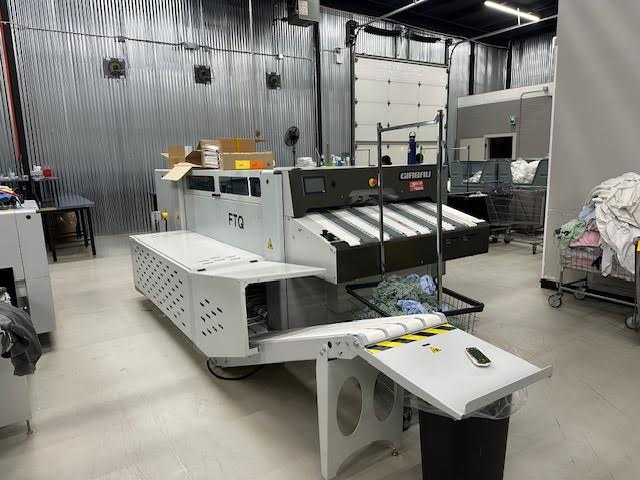

- Current era: **Shelton today**
- Current story: Towel programs depend on reliable processing, folding, and return so clean goods are ready to stock when the customer needs them.
- Review: `[ ] Approve` `[ ] Revise` `[ ] Replace`
- Partner notes:

### Montage 21 / photo-wall-21 — Amanda Waskin

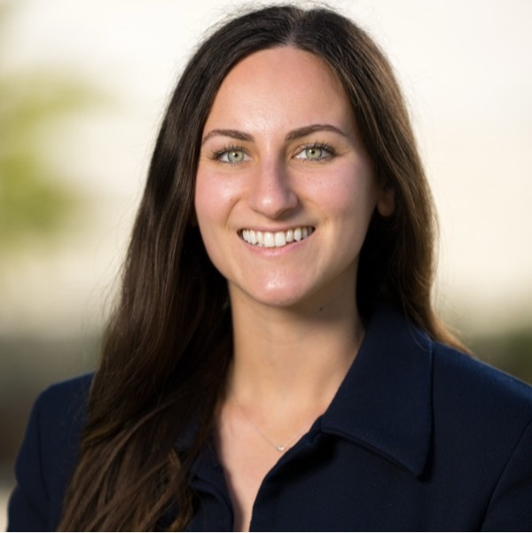

- Current role: **Owner / Sales Director**
- Current phone: **760-528-0003**
- Current email: **amanda@sheltonlinen.com**
- Current story: Drawing on a long career in sales and customer service, Amanda connects each client's needs with the day-to-day operation, helping ensure clear communication and a program that works in practice.
- Review: `[ ] Approve` `[ ] Revise` `[ ] Replace`
- Partner notes:

### Montage 23 / photo-wall-23 — Vaile Shelton

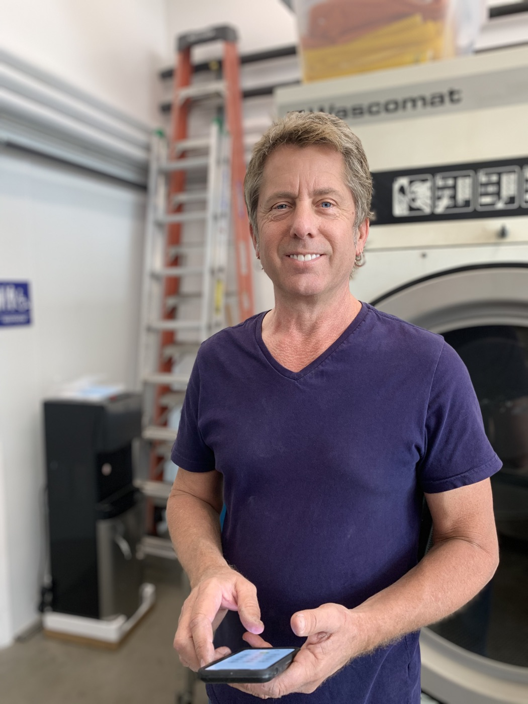

- Current role: **Owner**
- Current phone: **619-289-8583**
- Current email: **vaile@sheltonlinen.com**
- Current story: Vaile entered the cleaning industry directly after high school and has spent the past four decades helping customers and building service businesses. During that time, he has opened 67 dry-cleaning locations and expanded the family's laundry operations.
- Review: `[ ] Approve` `[ ] Revise` `[ ] Replace`
- Partner notes:

### Montage 24 / photo-wall-24 — Nelson Torres

- Current role: **General Manager**
- Current phone: **619-324-3563**
- Current email: **nelson@sheltonlinen.com**
- Current story: Nelson brings more than 20 years of experience in dry cleaning and laundry to his role as General Manager, guiding the Shelton operation and the team behind its daily service.
- Review: `[ ] Approve` `[ ] Revise` `[ ] Replace`
- Partner notes:

### Montage 25 / photo-wall-25 — Dodge Cleaners

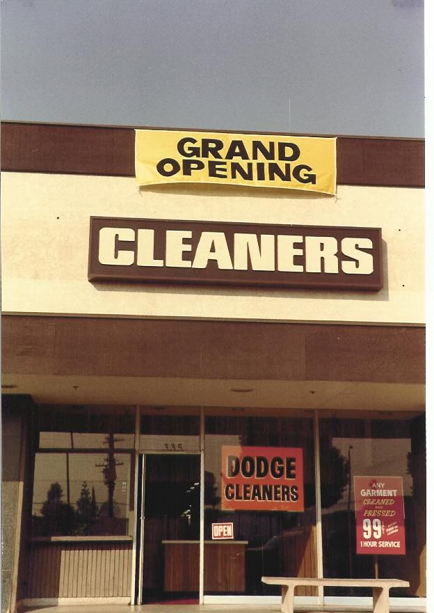

- Current era: **Azusa, 1981**
- Current story: Dodge Cleaners is another piece of the family cleaning archive, connecting storefront service, plant work, and customer trust across generations.
- Review: `[ ] Approve` `[ ] Revise` `[ ] Replace`
- Partner notes:

### Montage 26 / photo-wall-26 — Ford Cleaners

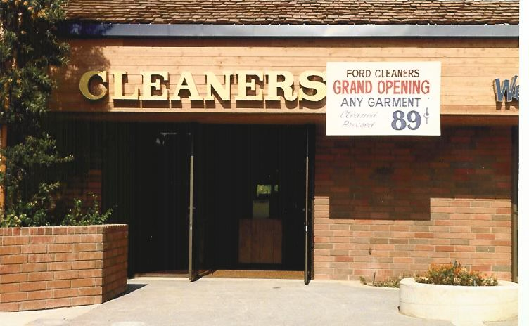

- Current era: **Laguna Niguel, 1981**
- Current story: Ford Cleaners reflects the same family trade in another community: cleaning, finishing, and presenting garments with care.
- Review: `[ ] Approve` `[ ] Revise` `[ ] Replace`
- Partner notes:

### Montage 27 / photo-wall-27 — Imperial Cleaners

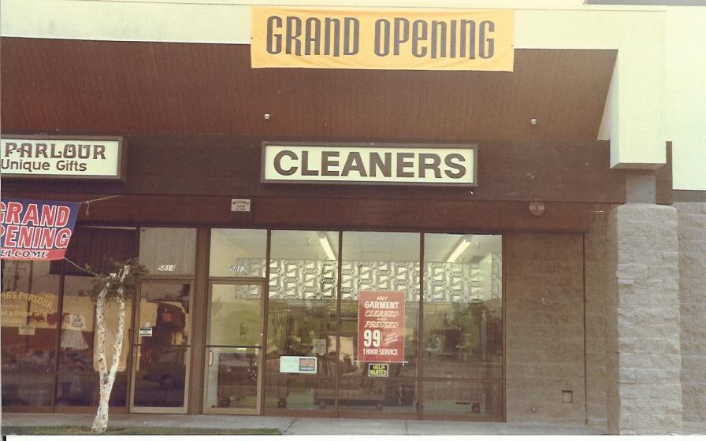

- Current era: **Long Beach, 1981**
- Current story: Opened in Long Beach, Imperial Cleaners reflects the family's growth throughout the twentieth century. With each new operation, the Shelton name became more deeply rooted in professional dry cleaning.
- Review: `[ ] Approve` `[ ] Revise` `[ ] Replace`
- Partner notes:

### Montage 28 / photo-wall-28 — GreenEarth cleaning machine

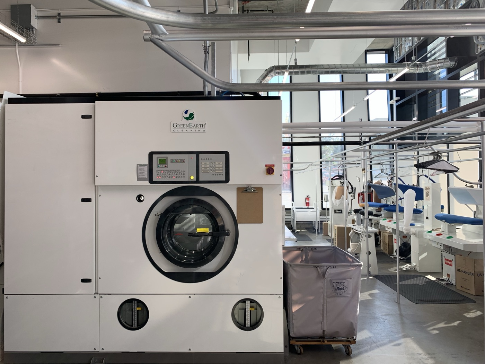

- Current era: **Shelton today**
- Current story: Modern cleaning equipment helps carry the family standard forward inside today's Shelton operation.
- Review: `[ ] Approve` `[ ] Revise` `[ ] Replace`
- Partner notes:

## 3. Towel timeline — 9 placements

The desktop towel timeline and compact/mobile linen-fold timeline use the same nine pictures and the same stories, so each is listed once.

### Timeline 01 — White Star Laundry Begins

- Current date: **c. 1898**
- Current story: In Oklahoma, Grandpa and Grandma Shelton joined Gertie, Elma, Mary, John Shelton, Sr., Mason Shelton, and others to open White Star Laundry. The business began a family trade in cleaning, finishing, service, and customer care that would continue through four generations.
- Review: `[ ] Approve` `[ ] Revise` `[ ] Replace`
- Partner notes:

### Timeline 02 — Unit Laundry Takes Root in Tucson

- Current date: **1930s**
- Current story: By the 1930s, Unit Laundry had become the family's next major chapter in Tucson. The building and route vehicles reflect a growing operation, while the daily work remained grounded in careful processing, reliable pickup and return, and goods finished for immediate use.
- Review: `[ ] Approve` `[ ] Revise` `[ ] Replace`
- Partner notes:

### Timeline 03 — The Family Reaches San Diego

- Current date: **1950s**
- Current story: Unit Cleaners marked the family's first presence in San Diego. The family built the facility and completed its installation and setup themselves, bringing hands-on knowledge of plant design, equipment, cleaning, and finishing into a new market.
- Review: `[ ] Approve` `[ ] Revise` `[ ] Replace`
- Partner notes:

### Timeline 04 — State Street Operations Grow

- Current date: **1960s**
- Current story: The State Street assembly area shows the organized work required to move finished garments back to customers accurately and efficiently. As the operation grew, new generations carried the trade forward while adapting to changing equipment, greater volume, and higher customer expectations.
- Review: `[ ] Approve` `[ ] Revise` `[ ] Replace`
- Partner notes:

### Timeline 05 — Imperial Cleaners in Long Beach

- Current date: **1981**
- Current story: Imperial Cleaners opened in Long Beach as the family's network continued to grow across Southern California. By 1981, the Shelton name had become increasingly rooted in professional dry cleaning through neighborhood locations built around dependable care and service.
- Review: `[ ] Approve` `[ ] Revise` `[ ] Replace`
- Partner notes:

### Timeline 06 — Modern Plant Operations

- Current date: **2003**
- Current story: The Sterling Cleaners boiler room in Indianapolis illustrates the infrastructure behind a modern cleaning plant. Reliable heat, pressure, equipment, and maintenance supported the visible service customers experienced at the counter and the quality delivered with every finished order.
- Review: `[ ] Approve` `[ ] Revise` `[ ] Replace`
- Partner notes:

### Timeline 07 — Shelton Cleaners Opens

- Current date: **2019**
- Current story: Shelton Cleaners opened in San Diego as the retail home for the family's next chapter. The storefront connected decades of cleaning experience with a modern local operation focused on garment care, responsive service, and the trust built through direct customer relationships.
- Review: `[ ] Approve` `[ ] Revise` `[ ] Replace`
- Partner notes:

### Timeline 08 — Shelton Launches Wholesale Department

- Current date: **2023**
- Current story: Shelton launched a wholesale department to support commercial partners that needed dependable cleaning and finishing capacity behind the scenes. The expansion brought the family's operating experience into larger-volume relationships while preserving careful handling, organized return, and responsive service.
- Review: `[ ] Approve` `[ ] Revise` `[ ] Replace`
- Partner notes:

### Timeline 09 — Shelton Linen & Uniform Services

- Current date: **2026**
- Current story: Shelton Linen & Uniform Services carries the family trade into dedicated commercial programs for linens, uniforms, towels, event goods, and wholesale partners. Modern equipment and route service support today's volume, while the standard remains rooted in careful cleaning, proper finishing, and dependable return.
- Review: `[ ] Approve` `[ ] Revise` `[ ] Replace`
- Partner notes:

## Reserved montage slot without a picture

- Slot: `photo-wall-22`
- Name: **Jordan Hudson**
- Current role: **Owner**
- Current phone: **619-333-0966**
- Current email: **jordan@sheltonlinen.com**
- Current story: Jordan leads the family business with a focus on thoughtful growth, practical innovation, and consistently high standards of customer service.
- Needed: portrait only.
